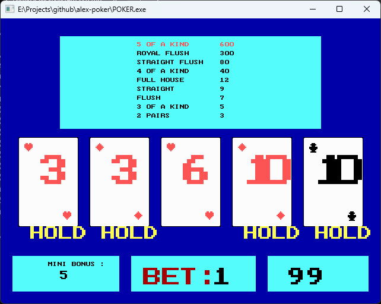

# Alex Poker
It's a basic five-card draw poker game as it was played on the video poker machines in the 90s.

Written in Pascal by my friend Alex Mazilu in 1995.

# How To Play
Enter to deal.

1-5 to toggle holding cards.

9 to increase bet/deal additional cards (?).

ESC to exit.

# Issues
* sometimes ESC doesn't seem to exit the game;
* closing the window might not work (seems like an FPC/PTCGraph issue?)
* "deal additional cards" bit (after you get a winning hand) doesn't seem to be playing correctly (might be mistaken though, not sure how this is supposed to work in the first place :)

# License
https://opensource.org/licenses/MIT

# Install&Build
Install the Free Pascal compiler, at least version 3.2.2

For Windows, run !(build_poker.bat) to build&run

Should build&run fine on any other platform supported by Free Pascal compiler.

# Screenshots

